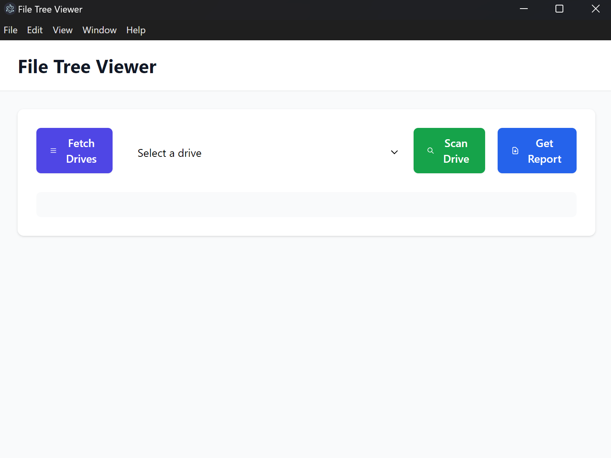

### Installation and Usage Guide

#### System Requirements
- **Operating Systems**:
  - Windows 10 or later

- **External Hardware**:
  - An external hard drive with NTFS file system

#### Installation Steps

1. **Clone the Repository**:
    ```sh
    git clone https://github.com/iipacii/DriveScanner.git
    cd DriveScanner
    ```

2. **Backend Setup**:
    - Navigate to the backend directory:
      ```sh
      cd backend
      ```
    - Install the required Python packages:
      ```sh
      pip install -r requirements.txt
      ```
    - Set up the environment variable:
      - Create a `.env` file in the `backend` directory:
        ```sh
        echo VIRUSTOTAL_API_KEY=your_api_key_here > .env
        echo VIRUSTOTAL_API_URL=https://www.virustotal.com/api/v3 >> .env
        ```

3. **Frontend Setup**:
    - Navigate to the frontend directory:
      ```sh
      cd ../frontend
      ```
    - Install the required Node.js packages:
      ```sh
      npm install
      ```

#### Usage Instructions

1. **Start the Backend Server**:
    - Navigate to the backend directory:
      ```sh
      cd backend
      ```
    - Start the FastAPI server:
      ```sh
      uvicorn main:app --reload
      ```

2. **Start the Frontend Application**:
    - Navigate to the frontend directory:
      ```sh
      cd ../frontend
      ```
    - Start the Electron application:
      ```sh
      npm start
      ```

3. **Using the Application**:
    - Open the application.
    - Click on "Fetch Drives" to list available drives.
      
    - Select a drive from the dropdown menu.
      
    - Click on "Scan Drive" to start scanning the selected drive.
      
    - View the results in the visualization section.
      

#### Troubleshooting

- **Common Issues**:
  - **Dependency Installation Errors**:
    - Ensure you have the correct versions of Python and Node.js installed.
    - Check for any missing system dependencies and install them.

  - **Backend Server Not Starting**:
    - Check for any errors in the terminal and resolve missing dependencies.

  - **Frontend Application Not Starting**:
    - Ensure all Node.js packages are installed.
    - Check for any errors in the terminal and resolve missing dependencies.

#### Additional Information

- **Frontend Details**:
  - **index.html**:
    - Sets up the user interface for the Electron app.
    - Includes buttons for scanning a drive and generating a report.
    - Contains a container for visualizations and an output area for displaying messages.
  - **main.js**:
    - Main process script for the Electron app.
    - Creates a browser window and loads the `index.html` file.
    - Uses Electron modules like `app` and `BrowserWindow` to control the application's lifecycle and manage browser windows.
